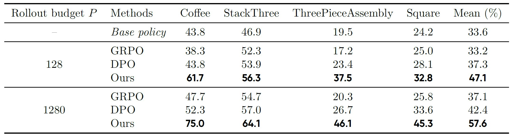
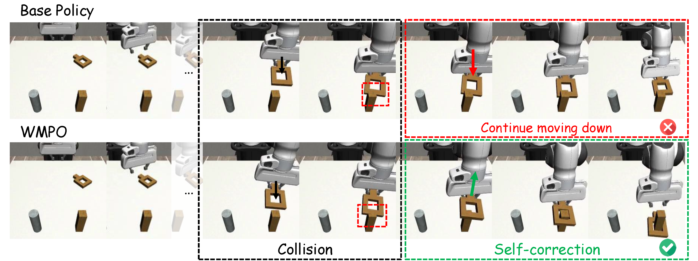
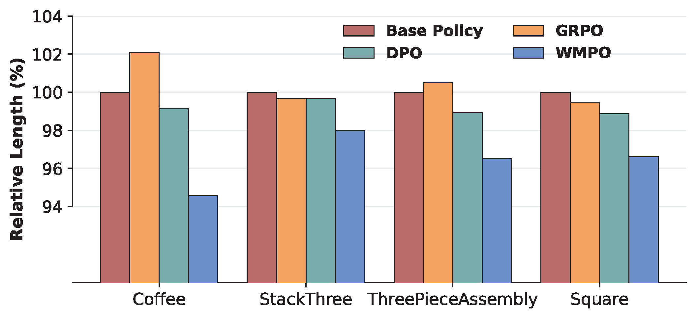

<h1 align="center"> WMPO: World Model-based Policy Optimization for Vision-Language-Action Models </h1>

<div align="center">
  <p>
    <a href="https://fangqi-zhu.github.io/"><strong>Fangqi Zhu</strong></a><sup>1,2</sup>
    ·
    <strong>Zhengyang Yan</strong><sup>1</sup>
    ·
    <a href="https://zicongs-homepage.webflow.io/"><strong>Zicong Hong</strong></a><sup>1</sup>
    ·
    <strong>Quanxin Shou</strong><sup>1</sup>
    ·
    <a href="https://yusufma03.github.io/"><strong>Xiao Ma</strong></a><sup>2*</sup>
    ·
    <a href="https://cse.hkust.edu.hk/~songguo/index.html"><strong>Song Guo</strong></a><sup>1*</sup>
    <br><br>
    <b><sup>1</sup>Hong Kong University of Science and Technology &nbsp; | &nbsp; <sup>2</sup>ByteDance Seed</b>
    <br>
    <em>* Corresponding author</em>
  </p>
</div>
<p align="center">
  <a href="https://arxiv.org/abs/xxxx.xxxxx">
    
  </a>
  <a href="https://WM-PO.github.io">
    
  </a>
  <a href="https://huggingface.co/fangqi/WMPO">
    
  </a>
</p>


### 📢 News

- **[2025-11]** We release the training code, data and checkpoints for WMPO. Check it out!

### ✅ Todo

- [x] Release the training code and training scripts for WMPO (4 Tasks)
- [x] Release the checkpoints (VLAs and world models) and training data for WMPO (4 Tasks)
- [ ] Release the training code for world models


## 📖 Introducing WMPO

We introduce **World-Model-based Policy Optimization (WMPO)**, a principled framework for on-policy VLA RL without interacting with the real environment. In contrast to widely used latent world models, WMPO focuses on pixel-based predictions that align the *"imagined"* trajectories with the VLA features pretrained with web-scale images. Crucially, WMPO enables the policy to perform on-policy GRPO that provides stronger performance than the often-used off-policy methods. Extensive experiments in both simulation and real-robot settings demonstrate that WMPO (i) substantially improves sample efficiency, (ii) achieves stronger overall performance, (iii) exhibits emergent behaviors such as self-correction, and (iv) demonstrates robust generalization and lifelong learning capabilities.

### How WMPO Works?

The overall training procedure consists of three components: (1) **Imagined Trajectory Generation**, where policy model and world model interact alternately to generate a full imagined trajectory; (2) **Trajectory Sampling**, where multiple trajectories are sampled and evaluated by the reward model ; and (3) **Policy Update**, where the policy parameters are optimized.


## ⚒️ Getting Started

### Install the environment

We recommend use `python=3.11.x` and `torch=2.5.1` on a Linux server (e.g., Ubuntu), and use `pip` or `conda` to manage the environment.

Run the following command to complete environment installation:

```bash
pip install -r requirements.txt
bash install.sh
```

### Prepare datasets and pre-trained checkpoints

Download the datasets and checkpoints using the following command:

```
python download_hf.py
```

The checkpoint files are in the following organization, the name of each checkpoint indicates the corresponding task that is trained on.

```
checkpoint_files
├── reward_models
│   ├── videomae_coffee.pth
│   ├── videomae_square.pth
│   ├── videomae_stack_three.pth
│   └── videomae_three_piece_assembly.pth
├── SFT_models
│   ├── coffee
│   ├── square
│   ├── stack_three
│   └── three_piece_assembly
├── WMPO_models
│   ├── coffee
│   ├── square
│   ├── stack_three
│   └── three_piece_assembly
└── world_models
    ├── coffee
    ├── OpenSora-STDiT-v3
    ├── OpenX_pretrained
    ├── square
    ├── stack_three
    ├── three_piece_assembly
    └── vae
```

`reward_models` are the VideoMAE models we used to calculated the reward of a world model rollout. 

`SFT_models` are the base policy VLAs before performing WMPO.

`WMPO_models` are the final optimized VLAs by performing RL in the world models with our WMPO framework.

`world_models` are first fine-tuned from `OpenSora-STDiT-v3` checkpoint into `OpenX_pretrained` checkpoint on the Open X-Embodiment (OXE) dataset, and then trained within the WMPO framework. All world models share the same variational auto-encoder `vae`.

## 🚀 Running the experiments

### Single Node Training

Use `bash examples/mimicgen/{Task Name}/train_wmpo_{Rollout Budget}.sh` directly to run the experiments, set `NUM_NODES=1` and `NUM_GPUS` to the number of GPUs that you have.  `{Task Name}` can be `coffee`, `square`, `stack_three`, `three_piece_assembly` and `Rollout Budget` can be `128` or `1280`. 

Set your `WANDB_API_KEY` in both the config file and `align.json` if you want to use wandb to log the experiments.

Below shows the example paths of config files.

| Task Name            | Settings                          | Example Config File Path                                    |
| -------------------- | --------------------------------- | ----------------------------------------------------------- |
| coffee               | WMPO with rollout budget `P=128`  | `examples/mimicgen/coffee/train_wmpo_128.sh`                |
| three_piece_assembly | WMPO with rollout budget `P=1280` | `examples/mimicgen/three_piece_assembly/train_wmpo_1280.sh` |

### Multiple Nodes Training

We use `Ray` to manage the clusters. Run `bash launch_head.sh` on the head node and `bash launch_worker.sh` on worker nodes. Set `NUM_NODES` and `NUM_GPUS` to the number of nodes and GPUs you have, and adjust the placeholder IP address in the scripts accordingly.

After setting up the clusters, simply start the task on the head node!

## 📊 Evaluation and Results

### Evaluating WMPO

Use `bash examples/mimicgen/{Task Name}/evaluate.sh` to evaluate the pre-trained models. Follow the default training settings for reproducibility. You can also adjust `TARGET_MODEL_PATH` to evaluate the checkpoint you want.

### Result - WMPO outperforms DPO and GRPO



<p align="center"><strong>Table 1.</strong>  Comparison of policy optimization methods across four manipulation tasks in the Mimicgen simulation benchmark. Results show that WMPO consistently outperforms both GRPO and DPO baselines under different budgets. As the rollout budget increases from 128 to 1280, WMPO continues to exhibit substantial improvements, highlighting both its data efficiency and scalability.</p>

### Result - Emergent Behaviors with WMPO



<p align="center"><strong>Figure 3.</strong> Behavior analysis of the Square task (inserting the square into the stick) shows that, compared with the base policy, <strong>WMPO demonstrates the ability to self-correct</strong>.</p>



<p align="center"><strong>Figure 5.</strong> Relative average <strong>trajectory length of successful trials</strong> across different policies (Base Policy = 100%).</p>

## 🙏 Acknowledgement

We thank the following great open-sourced project which our codebase relies on: [Open-Sora](https://github.com/hpcaitech/Open-Sora), [openvla-oft](https://github.com/moojink/openvla-oft), [VideoMAE](https://github.com/MCG-NJU/VideoMAE), [verl](https://github.com/volcengine/verl), [mimicgen](https://github.com/NVlabs/mimicgen), [SimpleVLA-RL](https://github.com/PRIME-RL/SimpleVLA-RL).

We would like to express our sincere gratitude to [Yikun Miao](https://scholar.google.com/citations?user=qyHfMJAAAAAJ&hl=en) for his valuable assistance in preparing the open-source release.

## 🎓 Citation

If you find WMPO useful for your research and applications, please consider starring this repository and citing:

```
@article{WMPO2025,
  title={WMPO: World Model-based Policy Optimization for Vision-Language-Action Models},
  author={Fangqi, Zhu and Zhengyang, Yan and Zicong, Hong and Quanxin, Shou and Xiao, Ma and Song, Guo},
  journal={ArXiv},
  year={2025},
  url={https://WM-PO.github.io}
}
```
